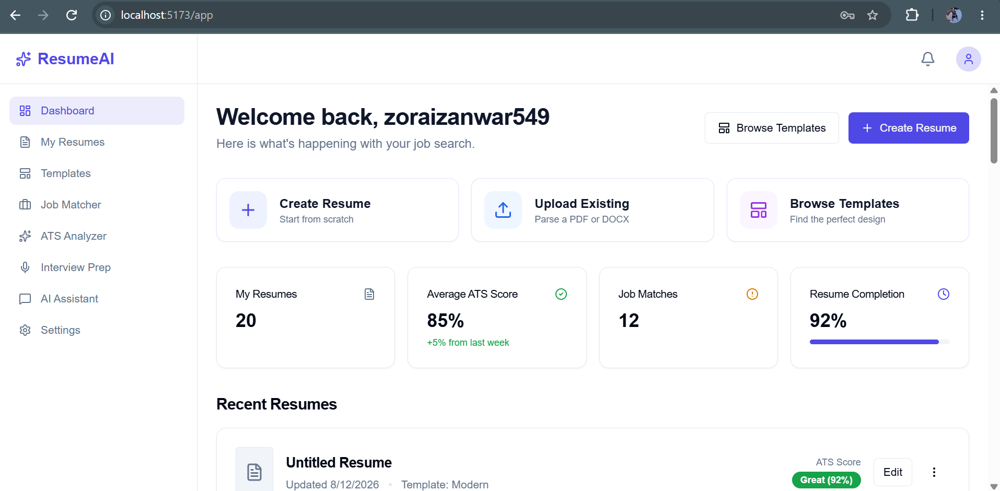
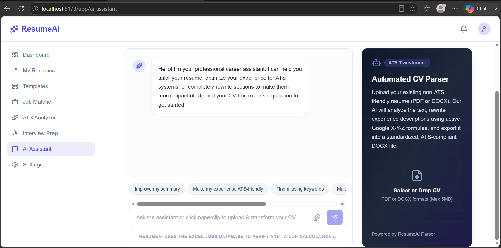
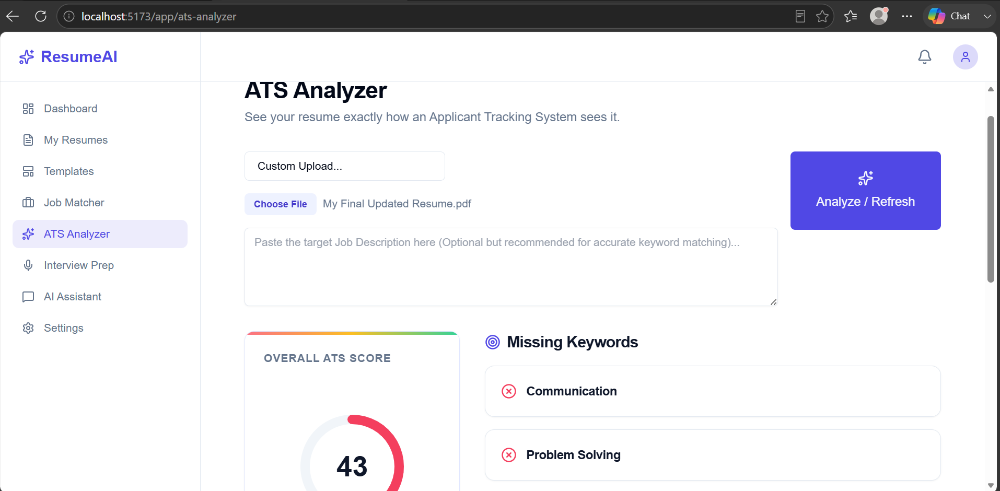
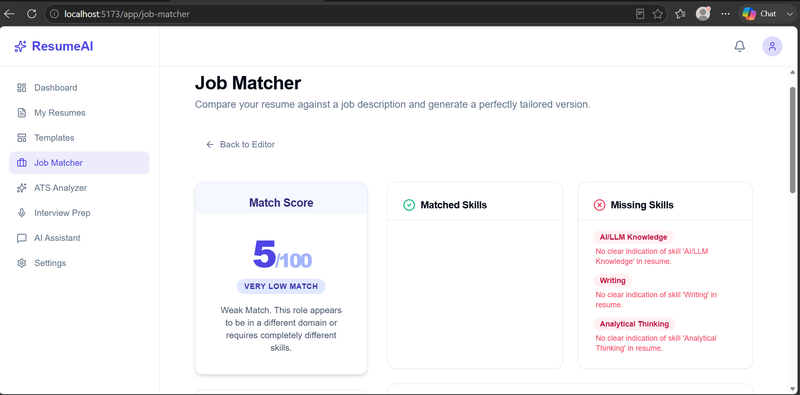
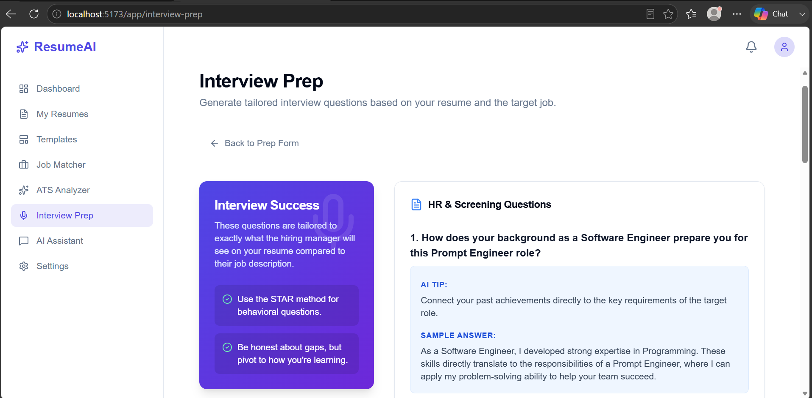
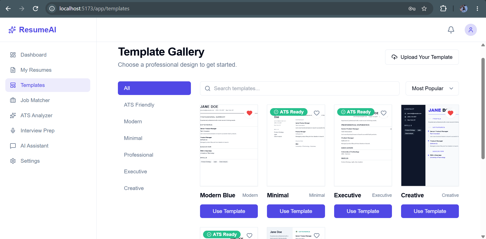

# AI Resume Builder

An AI-powered full-stack resume platform that helps users create, analyze, optimize, and tailor resumes for specific job opportunities.

The application combines resume building, AI-assisted content generation, ATS analysis, job matching, resume tailoring, and interview preparation in one platform.

## Features

### Resume Builder
- Create resumes using a structured resume editor
- Manage personal information, education, experience, skills, projects, certifications, awards, languages, and custom sections
- Live resume preview
- Multiple professional resume templates
- Resume version management
- Import existing resumes
- Export generated resumes

### AI-Powered Resume Assistance
- AI-generated resume content
- AI-assisted improvements
- Resume summary and section generation
- Job-specific resume tailoring
- AI assistant for resume-related tasks

### ATS Analysis
- Analyze resumes against Applicant Tracking System requirements
- Identify missing or relevant keywords
- Evaluate resume content
- Provide optimization insights

### Job Matching
- Match resumes against job descriptions
- Analyze role compatibility
- Identify keyword and skill gaps
- Provide detailed job-match results
- Tailor resumes for specific job opportunities

### Interview Preparation
- Generate interview preparation material
- Prepare questions and answers based on a target role
- AI-assisted interview preparation

### Authentication
- User registration and login
- JWT-based authentication
- Protected application routes
- User-specific resume data

## Technology Stack

### Frontend
- React
- Vite
- Tailwind CSS
- JavaScript
- Axios
- Recharts

### Backend
- Python
- Django
- Django REST Framework
- JWT Authentication
- PostgreSQL
- Pandas

### AI
- Groq API
- LLM-based resume analysis and generation
- Abstract AI provider architecture
- Mock AI provider for testing
- OpenAI provider support

### Documents
- DOCX generation
- PDF generation/conversion
- Resume document processing

### DevOps
- Docker
- Docker Compose
- Nginx
- Production-oriented environment configuration
- Health and readiness endpoints

## Architecture

```text
┌───────────────────────┐
│      React Frontend   │
│   Vite + Tailwind CSS │
└───────────┬───────────┘
            │
            │ REST API
            ▼
┌───────────────────────┐
│   Django REST API     │
│                       │
│ Authentication        │
│ Resume Management     │
│ ATS Analysis          │
│ Job Matching          │
│ Interview Preparation │
│ Document Generation   │
└───────────┬───────────┘
            │
      ┌─────┴─────┐
      ▼           ▼
┌───────────┐  ┌──────────────┐
│ PostgreSQL│  │ AI Providers │
│ Database  │  │ Groq/OpenAI  │
└───────────┘  └──────────────┘

## Screenshots

### Landing Page


### AI Assistant


### ATS Analyzer


### Job Matcher


### Interview Preparation


### Resume Templates
